# Отчет по дисциплине

**"Технология проектирования автоматизированных систем в защищенном исполнении"**

## Тема работы

**Разработка и деплой веб-сервиса для аудита защищенности рабочих станций**

## Данные о работе

**Проект:** `protected-workstation-audit-service`

**Студенты:** `gofman03`, `aksenov04`, `kopan05`

**Дата выполнения:** `17.06.2026`

**GitHub:** `https://github.com/nxnk88/protected-workstation-audit-service`

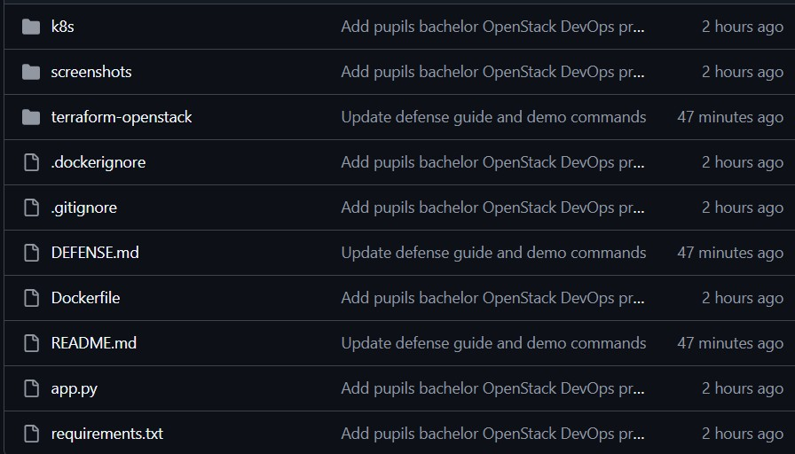

## 1. Цель работы

Цель работы - разработать учебный DevOps-проект, который демонстрирует полный цикл подготовки и развертывания веб-сервиса:

- разработка REST API на FastAPI;
- обработка тестовых данных с помощью pandas;
- упаковка приложения в Docker-образ;
- публикация образа в Docker Hub;
- описание инфраструктуры OpenStack через Terraform;
- автоматическая настройка VM через cloud-init;
- запуск приложения в Kubernetes/Minikube.

## 2. Описание проекта

`protected-workstation-audit-service` - это FastAPI-сервис для аудита защищенности рабочих станций. Внутри приложения находится тестовый набор рабочих станций. Для каждой станции хранятся:

- `hostname` - имя рабочей станции;
- `department` - подразделение;
- `hardening_score` - оценка защищенности конфигурации;
- `antivirus_enabled` - признак включенного антивируса;
- `disk_encryption` - признак включенного шифрования диска.

Рабочая станция считается готовой к вводу в защищенный контур, если:

- `hardening_score >= 85`;
- `antivirus_enabled = true`;
- `disk_encryption = true`.

## 3. Используемые технологии

- Python 3.11;
- FastAPI;
- Uvicorn;
- pandas;
- Docker;
- Docker Hub;
- Terraform `>= 1.5.0`;
- OpenStack Terraform provider `terraform-provider-openstack/openstack`;
- OpenStack;
- cloud-init;
- Kubernetes;
- Minikube;
- kubectl.

## 4. Структура репозитория

```text
.
├── app.py
├── requirements.txt
├── Dockerfile
├── .dockerignore
├── .gitignore
├── README.md
├── screenshots/
├── terraform-openstack/
│   ├── versions.tf
│   ├── variables.tf
│   ├── main.tf
│   ├── outputs.tf
│   ├── cloud-init.yaml
│   ├── terraform-init.ps1
│   ├── terraform.tfvars.example
│   └── README.md
└── k8s/
    ├── namespace.yaml
    ├── deployment.yaml
    └── service.yaml
```

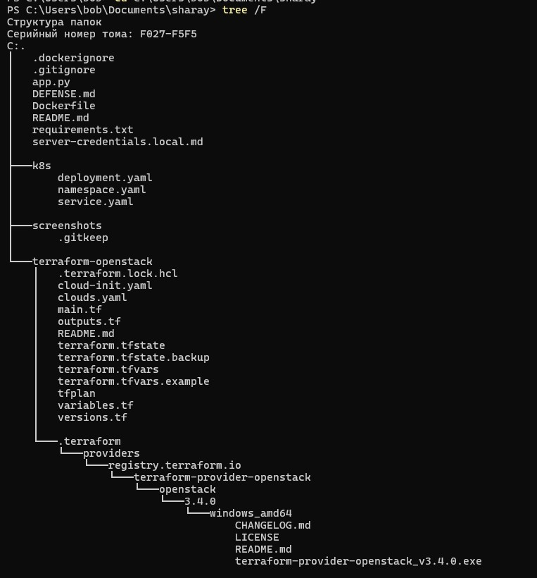

## 5. Описание API

| Метод | Путь | Назначение |
| --- | --- | --- |
| `GET` | `/` | Главная страница сервиса |
| `GET` | `/health` | Проверка состояния приложения |
| `GET` | `/workstations` | Список всех рабочих станций |
| `GET` | `/workstations?department=...` | Фильтрация по подразделению |
| `GET` | `/workstation/{hostname}` | Поиск рабочей станции по имени |
| `GET` | `/audit-ready` | Список станций, готовых к защищенному контуру |

Пример ответа `/audit-ready` содержит сообщение, количество готовых станций, распределение по подразделениям и список станций, прошедших аудит.

## 6. Локальный запуск без Docker

```powershell
cd C:\Users\bob\Documents\sharay
python -m venv venv
.\venv\Scripts\Activate.ps1
pip install -r requirements.txt
uvicorn app:app --reload --host 0.0.0.0 --port 8000
```

Проверка:

```powershell
curl.exe http://127.0.0.1:8000/
curl.exe http://127.0.0.1:8000/health
curl.exe http://127.0.0.1:8000/workstations
curl.exe http://127.0.0.1:8000/audit-ready
```

Swagger UI доступен по адресу:

```text
http://127.0.0.1:8000/docs
```

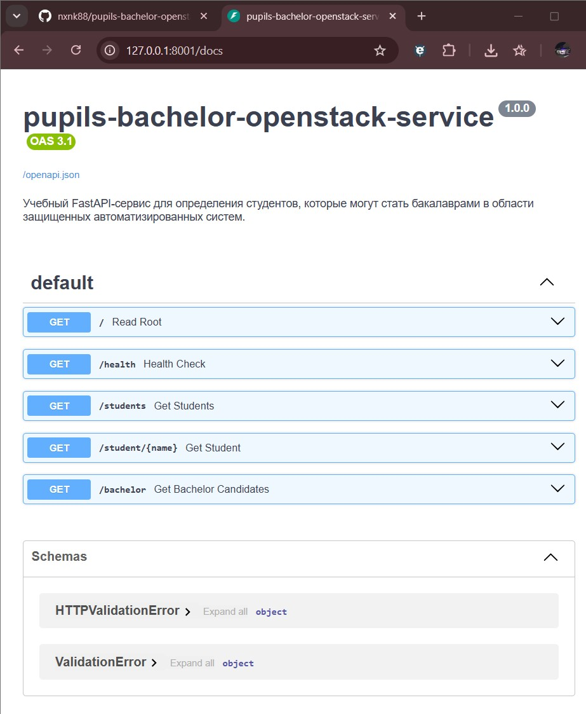

## 7. Docker

Проверенный локальный запуск контейнера:

```powershell
cd C:\Users\bob\Documents\sharay
docker build -t protected-workstation-audit-service .
docker rm -f workstation-audit
docker run -d --name workstation-audit -p 8001:8000 protected-workstation-audit-service
docker ps
curl.exe http://127.0.0.1:8001/health
curl.exe http://127.0.0.1:8001/audit-ready
```

Контейнер публикует порт приложения `8000` внутри контейнера на локальный порт `8001`, чтобы не конфликтовать с другими сервисами на машине.

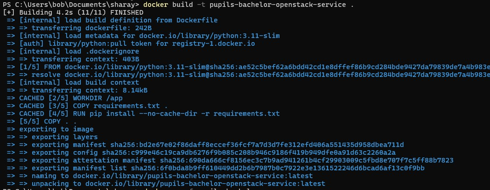

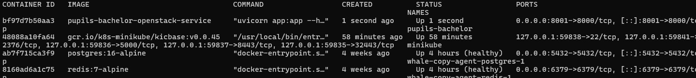

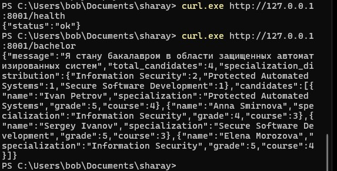

## 8. Публикация Docker-образа

```powershell
docker login
docker tag protected-workstation-audit-service xzxzxzxze/protected-workstation-audit-service:v1
docker push xzxzxzxze/protected-workstation-audit-service:v1
```

Фактически используемый образ:

```text
xzxzxzxze/protected-workstation-audit-service:v1
```

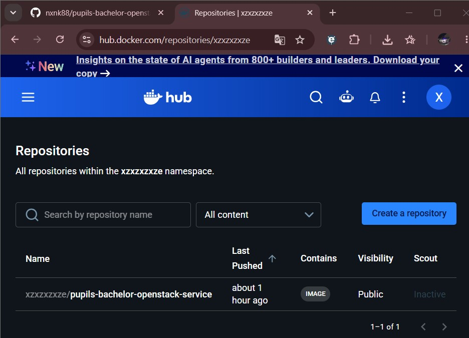

## 9. Развертывание в OpenStack через Terraform

Terraform-конфигурация находится в каталоге `terraform-openstack/`.

Она создает:

- приватную сеть `workstation-audit-network`;
- подсеть `workstation-audit-subnet`;
- роутер `workstation-audit-router`;
- Security Group `workstation-audit-sg`;
- правила входящего доступа `22/tcp` и `8000/tcp`;
- SSH keypair `workstation-audit-key`;
- сетевой порт VM;
- виртуальную машину `workstation-audit-vm`;
- Floating IP;
- привязку Floating IP к VM;
- cloud-init сценарий установки Docker и запуска контейнера.

Перед запуском нужно подготовить локальный `terraform.tfvars` на основе примера:

```powershell
cd C:\Users\bob\Documents\sharay\terraform-openstack
copy terraform.tfvars.example terraform.tfvars
```

В `terraform.tfvars` указываются реальные значения OpenStack и Docker-образа. Этот файл не должен попадать в GitHub.

Проверенные команды запуска:

```powershell
cd C:\Users\bob\Documents\sharay\terraform-openstack
.\terraform-init.ps1
terraform validate
terraform plan
terraform apply
terraform state list
terraform output
```

Если нужно выполнить запуск без интерактивного подтверждения:

```powershell
terraform apply -auto-approve
```

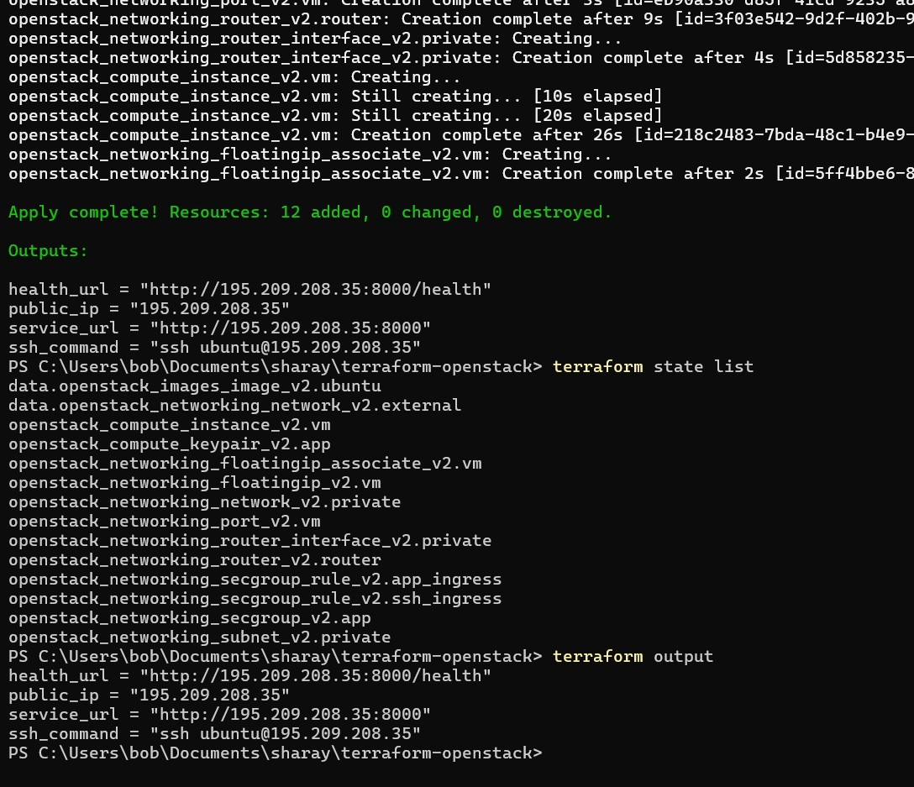

## 10. Проверка сервиса в OpenStack

После `terraform apply` получить IP:

```powershell
$ip = terraform output -raw public_ip
terraform output
```

Дождаться открытия SSH и порта приложения:

```powershell
for ($i=1; $i -le 20; $i++) {
  $ssh = Test-NetConnection -ComputerName $ip -Port 22 -InformationLevel Quiet
  $app = Test-NetConnection -ComputerName $ip -Port 8000 -InformationLevel Quiet
  "attempt $i ssh=$ssh app=$app"
  if ($ssh -and $app) { break }
  Start-Sleep -Seconds 30
}
```

Проверить API:

```powershell
curl.exe http://$ip:8000/health
curl.exe http://$ip:8000/audit-ready
```

Проверить VM по SSH:

```powershell
ssh ubuntu@$ip
cloud-init status --long
sudo docker ps
sudo docker logs workstation-audit
```

В проверенном запуске сервис ответил:

```json
{"status":"ok"}
```

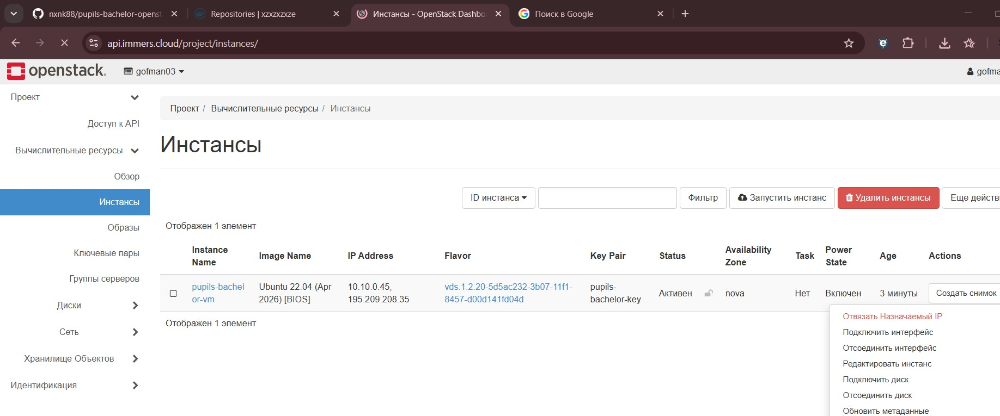

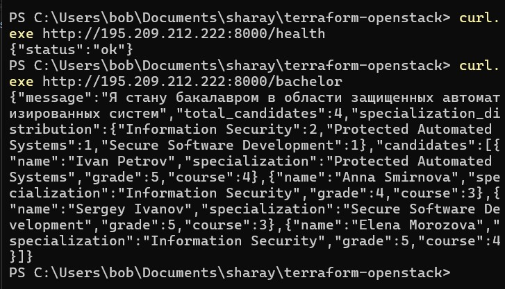

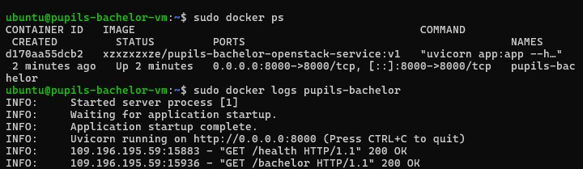

## 11. Kubernetes / Minikube

Манифесты находятся в каталоге `k8s/`.

- `namespace.yaml` создает namespace `workstation-audit`;
- `deployment.yaml` создает Deployment на 2 реплики;
- `service.yaml` создает NodePort Service на порту `30080`.

Проверенные команды запуска:

```powershell
cd C:\Users\bob\Documents\sharay
& "$env:TEMP\minikube-check\minikube-v1.34.0.exe" start --driver=docker --container-runtime=docker
kubectl apply -f .\k8s\namespace.yaml
kubectl apply -f .\k8s\deployment.yaml
kubectl apply -f .\k8s\service.yaml
kubectl rollout status deployment/workstation-audit-deployment -n workstation-audit --timeout=180s
kubectl get pods -n workstation-audit -o wide
kubectl get svc -n workstation-audit
kubectl get endpoints -n workstation-audit
```

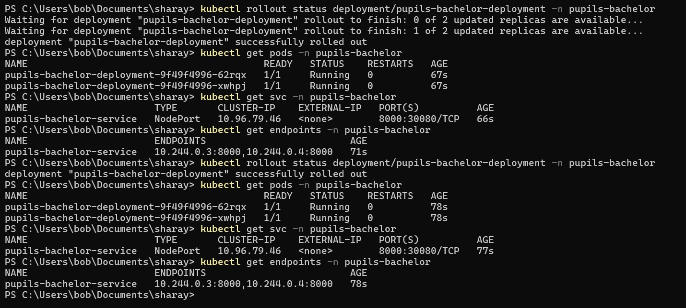

Проверка через port-forward:

```powershell
kubectl port-forward -n workstation-audit service/workstation-audit-service 18080:8000
```

В другом окне PowerShell:

```powershell
curl.exe http://127.0.0.1:18080/health
curl.exe http://127.0.0.1:18080/audit-ready
```

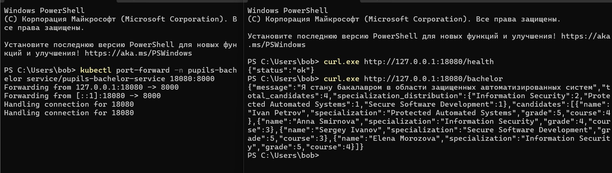

## 12. Остановка и удаление ресурсов

Локальный Docker-контейнер:

```powershell
docker rm -f workstation-audit
```

Kubernetes-ресурсы и Minikube:

```powershell
cd C:\Users\bob\Documents\sharay
kubectl delete namespace workstation-audit --ignore-not-found=true
& "$env:TEMP\minikube-check\minikube-v1.34.0.exe" delete
```

OpenStack-ресурсы, созданные Terraform:

```powershell
cd C:\Users\bob\Documents\sharay\terraform-openstack
terraform destroy
```

Без интерактивного подтверждения:

```powershell
terraform destroy -auto-approve
```

Проверка, что ресурсы удалены:

```powershell
docker ps -a
terraform state list
& "$env:TEMP\minikube-check\minikube-v1.34.0.exe" status
```

## 13. Полный сценарий запуска с нуля

```powershell
cd C:\Users\bob\Documents\sharay

docker build -t protected-workstation-audit-service .
docker rm -f workstation-audit
docker run -d --name workstation-audit -p 8001:8000 protected-workstation-audit-service
curl.exe http://127.0.0.1:8001/health

docker tag protected-workstation-audit-service xzxzxzxze/protected-workstation-audit-service:v1
docker push xzxzxzxze/protected-workstation-audit-service:v1

cd C:\Users\bob\Documents\sharay\terraform-openstack
.\terraform-init.ps1
terraform validate
terraform plan
terraform apply
$ip = terraform output -raw public_ip
curl.exe http://$ip:8000/health
curl.exe http://$ip:8000/audit-ready

cd C:\Users\bob\Documents\sharay
& "$env:TEMP\minikube-check\minikube-v1.34.0.exe" start --driver=docker --container-runtime=docker
kubectl apply -f .\k8s\namespace.yaml
kubectl apply -f .\k8s\deployment.yaml
kubectl apply -f .\k8s\service.yaml
kubectl rollout status deployment/workstation-audit-deployment -n workstation-audit --timeout=180s
kubectl get pods -n workstation-audit
kubectl get svc -n workstation-audit
kubectl get endpoints -n workstation-audit
kubectl port-forward -n workstation-audit service/workstation-audit-service 18080:8000
```

## 14. Скриншоты для отчета

В отчет включены иллюстрации основных этапов:

1. [screenshots/01-github-repository.jpg](screenshots/01-github-repository.jpg) - репозиторий на GitHub.
2. [screenshots/02-project-tree.jpg](screenshots/02-project-tree.jpg) - структура проекта.
3. [screenshots/03-swagger-ui.jpg](screenshots/03-swagger-ui.jpg) - Swagger UI.
4. [screenshots/04-docker-build.jpg](screenshots/04-docker-build.jpg) - сборка Docker-образа.
5. [screenshots/05-docker-container.jpg](screenshots/05-docker-container.jpg) - запущенный контейнер.
6. [screenshots/06-local-api-check.jpg](screenshots/06-local-api-check.jpg) - локальная проверка API.
7. [screenshots/07-docker-hub.jpg](screenshots/07-docker-hub.jpg) - опубликованный образ.
8. [screenshots/08-terraform-apply-state-output.jpg](screenshots/08-terraform-apply-state-output.jpg) - Terraform apply/state/output.
9. [screenshots/09-openstack-instance.jpg](screenshots/09-openstack-instance.jpg) - VM в OpenStack Dashboard.
10. [screenshots/10-openstack-api-check.jpg](screenshots/10-openstack-api-check.jpg) - проверка сервиса по Floating IP.
11. [screenshots/11-vm-docker-check.jpg](screenshots/11-vm-docker-check.jpg) - Docker на VM.
12. [screenshots/12-k8s-rollout-pods-service.jpg](screenshots/12-k8s-rollout-pods-service.jpg) - Kubernetes rollout, pods, service.
13. [screenshots/13-k8s-port-forward-check.jpg](screenshots/13-k8s-port-forward-check.jpg) - проверка через port-forward.

## 15. Безопасность

Нельзя хранить в GitHub:

- пароли и токены;
- `clouds.yaml`;
- `.env`;
- `terraform.tfvars` с реальными значениями;
- `terraform.tfstate` и backup state-файлы;
- приватные SSH-ключи.

В репозиторий добавлен только `terraform.tfvars.example` с шаблонными значениями.

## 16. Вывод

В ходе работы был создан полный учебный DevOps-проект для аудита защищенности рабочих станций. Реализовано FastAPI-приложение, подготовлен Docker-образ, описана OpenStack-инфраструктура через Terraform, настроен cloud-init для автоматического запуска контейнера на VM, а также подготовлены Kubernetes-манифесты для запуска сервиса в Minikube.

Практическая проверка показала, что сервис успешно запускается локально, в Docker, в OpenStack VM и в Kubernetes/Minikube.
